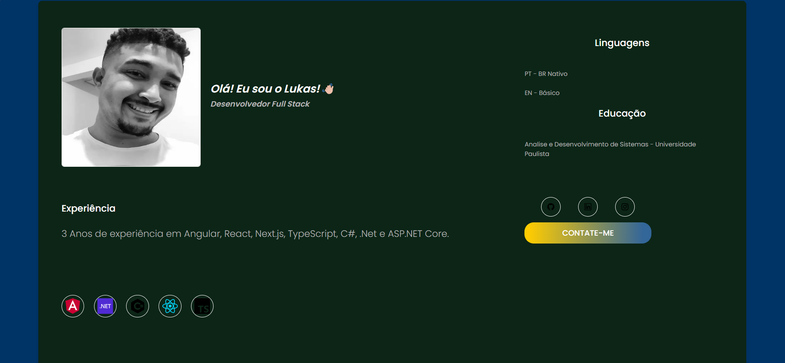

# Desenvolvendo um portifólio profissional

Projeto básico de um portifólio para auxíliar programadores iniciantes a terem seu primeiro portifólio.

## Tecnologías utilizadas 
### HTML, CSS, JavaScript e React.

# Layout do projeto.

# Como contribuir.

## Se você deseja contribuir com este projeto, siga os passos abaixo:

### Faça um Fork do Repositório
Clique no botão “Fork” no canto superior direito da página do repositório no GitHub.
Clone o Repositório Forkado
No seu terminal, clone o repositório forkado para sua máquina local:
git clone https://github.com/seu-usuario/Portifolio.git

### Navegue até o diretório do projeto:
cd Portifolio

Crie uma Branch para Suas Alterações

### Crie uma nova branch para suas alterações:
git checkout -b minha-branch

Faça as Alterações Necessárias e Commit
Faça as alterações no código.
 
### Adicione as alterações ao staging:
git add .

### Faça um commit das suas alterações:
git commit -m "Descrição das minhas alterações"

Envie as Alterações para o GitHub
Envie suas alterações para o repositório forkado:
git push origin minha-branch

Abra um Pull Request
No GitHub, vá até o seu repositório forkado.
Clique no botão “Compare & pull request”.
Preencha o formulário de pull request e envie.
Sincronize Seu Fork com o Repositório Original
Para manter seu fork atualizado com o repositório original, adicione um remoto upstream:
git remote add upstream https://github.com/Lukascumk/Portifolio.git

Busque as alterações do repositório original:
git fetch upstream

Mescle as alterações na sua branch principal:
git checkout main
git merge upstream/main